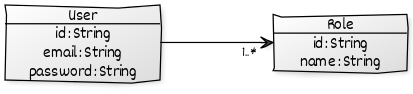

# redi2read

```
git submodule add git@github.com:redis-developer/redismod-docker-compose.git redi2read/docker
git submodule add git@github.com:redis-developer/redi2read-data.git redi2read/src/main/resources/data
cd redi2read
cd docker
docker-compose up
docker exec -it docker_redis_1 bash
/data# redis-cli 
127.0.0.1:6379> PING
PONG
127.0.0.1:6379> PING Marco!
"Marco!"
127.0.0.1:6379> MODULE LIST
.
127.0.0.1:6379> SET myname "Brian"
OK
127.0.0.1:6379> GET myname
"Brian"
127.0.0.1:6379> TYPE myname
string

127.0.0.1:6379> KEYS *
1) "myname"
2) "redi2read:strings:database:redis:creator"
127.0.0.1:6379> TYPE "redi2read:strings:database:redis:creator"
string
127.0.0.1:6379> GET "redi2read:strings:database:redis:creator"
"Salvatore Sanfilippo"

./mvnw clean spring-boot:run
.
curl --location --request POST 'http://localhost:8080/api/redis/strings' \
 --header 'Content-Type: application/json' \
 --data-raw '{ "database:redis:creator": "Salvatore Sanfilippo" }'
{"database:redis:creator":"Salvatore Sanfilippo"}

curl --location --request GET 'http://localhost:8080/api/redis/strings/database:redis:creator'
{"database:redis:creator":"Salvatore Sanfilippo"}

curl --location --request GET 'http://localhost:8080/api/redis/strings/database:neo4j:creator'
{"timestamp":"2021-04-15T10:00:06.748+00:00","status":404,"error":"Not Found"...}

redis-cli MONITOR
OK
1618480385.129302 [0 172.23.0.1:62448] "SET" "redi2read:strings:database:redis:creator" "Salvatore Sanfilippo"
1618480450.261937 [0 172.23.0.1:63296] "COMMAND"
1618480453.476876 [0 172.23.0.1:63296] "KEYS" "*"
1618480463.596025 [0 172.23.0.1:63296] "TYPE" "redi2read:strings:database:redis:creator"
1618480469.165282 [0 172.23.0.1:63296] "GET" "redi2read:strings:database:redis:creator"
1618480592.273111 [0 172.23.0.1:65136] "GET" "redi2read:strings:database:redis:creator"
1618480755.935903 [0 172.23.0.1:65136] "GET" "redi2read:strings:database:redis:editor"
1618480806.777170 [0 172.23.0.1:65136] "GET" "redi2read:strings:database:neo4j:creator"
```



